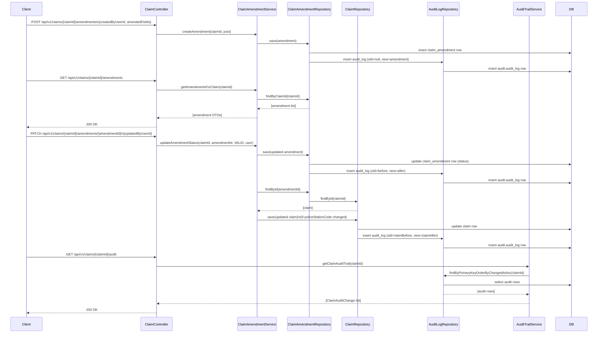

Claim Amendments — Reference

This document describes how a claim amendment is created and processed through the system. It contains a Mermaid flowchart showing the primary request paths, database writes (including audit log writes), and the key classes/methods involved.

Mermaid flowchart

```mermaid
flowchart LR
  %% Actors
  Client[Client - API caller]
  Validator[Validator / UI / API caller - mark valid/invalid]
  DB[(Postgres DB)]

  %% Request paths
  Client -->|POST /api/v1/claims/CLAIM_ID/amendments| CC[ClaimController.createClaimAmendmentForClaim]
  CC -->|calls| CAS[ClaimAmendmentService.createAmendment]
  CAS -->|validates & saves| RepoAmend[ClaimAmendmentRepository.save]
  RepoAmend -->|writes amendment row| DB
  RepoAmend -->|writes audit record| AuditAmendCreate[AuditLog - audit.audit_log]
  AuditAmendCreate --> DB
  DB -->|row created: status=READY_FOR_VALIDATION| AmendRow[claim_amendment - changed_fields JSON]

  %% Listing
  Client -->|GET /api/v1/claims/CLAIM_ID/amendments| CC2[ClaimController.listClaimAmendmentsForClaim]
  CC2 -->|calls| CAS2[ClaimAmendmentService.getAmendmentsForClaim]
  CAS2 --> RepoAmend
  RepoAmend --> DB

  %% Validation path
  Validator -->|PATCH/PUT mark valid| CC3[ClaimController.markClaimAmendmentValid]
  CC3 -->|calls| CAS3[ClaimAmendmentService.updateAmendmentStatus]
  CAS3 -->|validates updatedByUserId & state| RepoAmend2[ClaimAmendmentRepository.save]
  RepoAmend2 -->|updates amendment row| DB
  RepoAmend2 -->|writes audit record| AuditAmendUpdate[AuditLog - audit.audit_log]
  AuditAmendUpdate --> DB
  CAS3 -->|if status == VALID then| ACTION[actionAmendment with amendmentId]
  ACTION -->|loads amendment| RepoAmend3[ClaimAmendmentRepository.findById]
  RepoAmend3 --> DB
  ACTION -->|loads claim| RepoClaim[ClaimRepository.findById]
  RepoClaim --> DB
  ACTION -->|if policeStationCode changed -> update claim| RepoClaimSave[ClaimRepository.save]
  RepoClaimSave -->|updates claim row| DB
  RepoClaimSave -->|writes audit record| AuditClaimUpdate[AuditLog - audit.audit_log]
  AuditClaimUpdate --> DB

  %% Error paths / rules
  CAS -.->|throws| Error1[400 Bad Request] 
  CAS -.->|throws| Error2[409 / State Exception]
  CAS3 -.->|throws| Error3[404 Not Found]
  CAS3 -.->|throws| Error4[400 Bad Request if updatedByUserId missing]

  %% Audit access
  Client -->|GET /api/v1/claims/CLAIM_ID/audit| GetAudit[ClaimController.getClaimAudit]
  GetAudit -->|calls| AuditSvc[AuditTrailService.getClaimAuditTrail]
  AuditSvc --> AuditLogRepo[AuditLogRepository.findByPrimaryKeyOrderByChangedAtAsc]
  AuditLogRepo --> DB

  style RepoAmend fill:#f9f,stroke:#333,stroke-width:1px
  style RepoClaim fill:#f9f,stroke:#333,stroke-width:1px
```



Sequence diagram



Explanatory notes and mapping to code

1) Entry points (controller)
- `POST /api/v1/claims/{claimId}/amendments` -> `ClaimController.createClaimAmendmentForClaim(...)`
  - File: `claims-data/service/src/main/java/uk/gov/justice/laa/dstew/payments/claimsdata/controller/ClaimController.java`
  - Calls `ClaimAmendmentService.createAmendment(claimId, claimAmendmentPost)`.

- `GET /api/v1/claims/{claimId}/amendments` -> `ClaimController.listClaimAmendmentsForClaim(...)`
  - Calls `ClaimAmendmentService.getAmendmentsForClaim(claimId)` and maps `ClaimAmendment` -> `ClaimAmendmentGet` DTOs.

- `PUT/PATCH` mark valid/invalid
  - `ClaimController.markClaimAmendmentValid(...)` -> `ClaimAmendmentService.updateAmendmentStatus(..., AmendmentStatus.VALID, updatedByUserId)`
  - `ClaimController.markClaimAmendmentInvalid(...)` -> `ClaimAmendmentService.updateAmendmentStatus(..., AmendmentStatus.INVALID, updatedByUserId)`

2) Service behaviour (`ClaimAmendmentService`)
- createAmendment(claimId, post)
  - Validates claim exists (`validateClaimExists` -> `ClaimRepository.findById`).
  - Validates `createdByUserId` is present.
  - Ensures no other amendment for claim is in `READY_FOR_VALIDATION` state.
  - Validates each `AmendedField` against allowed list and expected types.
  - Persists a new `ClaimAmendment` with:
    - `claimAmendmentId` (random UUID),
    - `status` = READY_FOR_VALIDATION,
    - `changedFields` JSON persisted into `changed_fields` (see `ClaimAmendment` entity).

- updateAmendmentStatus(claimId, amendmentId, status, updatedByUserId)
  - Validates `updatedByUserId` present.
  - Loads amendment, checks it belongs to claim.
  - Enforces that the amendment is currently `READY_FOR_VALIDATION`.
  - Sets `status` to requested value, sets `updatedByUserId` & `updatedOn`, saves.
  - If status = VALID then calls `actionAmendment(amendmentId)`.

- actionAmendment(amendmentId)
  - Loads amendment and requires `updatedByUserId` to be present (otherwise 400).
  - Loads `Claim` entity for amendment.claimId.
  - Iterates `changedFields` to find `policeStationCode` change.
  - If `policeStationCode` is present and different from `claim.getPoliceStationCourtPrisonId()` then:
    - Update `claim.setPoliceStationCourtPrisonId(newPoliceStationCode)`,
    - Update `claim.setUpdatedOn(Instant.now())` and `claim.setUpdatedByUserId(updatedByUserId)`,
    - Persist claim with `claimRepository.save(claim)`.

3) Persistence mapping
- `ClaimAmendment` entity (`.../entity/ClaimAmendment.java`) maps `changedFields` as JSON/JSONB via `@JdbcTypeCode(SqlTypes.JSON)` and `columnDefinition = "jsonb"`.
- `Claim` entity (`.../entity/Claim.java`) contains the field `policeStationCourtPrisonId` that may be updated by an amendment.

4) Allowed amended fields and types (as enforced by `validateAmendedFields`)
- profitCosts — BigDecimal
- disbursements — BigDecimal
- disbursementsVAT — BigDecimal
- counselsCosts — BigDecimal
- policeStationCode — String

Notes, caveats, and extension points

- Only `policeStationCode` is acted upon in `actionAmendment`. Other allowed fields are validated but no action is performed by `actionAmendment` (they may be used by other parts of the system or extended later).
- `isAmended` flag exists on `Claim` but is not set by `actionAmendment`. If you expect that to change, add setting it in `actionAmendment` before saving the claim.
- Concurrency/state: `createAmendment` prevents multiple `READY_FOR_VALIDATION` amendments per claim by checking existing rows. This check is performed in memory and is not atomic — consider adding a DB-side unique constraint or transactional locking if race conditions are a concern.
- Validation and error responses:
  - Missing `createdByUserId` or `updatedByUserId` -> `ClaimAmendmentBadRequestException` (400).
  - Trying to create a new amendment when another is `READY_FOR_VALIDATION` -> `ClaimAmendmentStateException`.
  - Trying to change status when current status is not `READY_FOR_VALIDATION` -> `ClaimAmendmentStateException`.
  - Amendment not found -> `ClaimAmendmentNotFoundException` (404).

Sample request payloads

Create amendment (POST):
```json
{
  "createdByUserId": "user-123",
  "amendedFields": [
    { "fieldName": "policeStationCode", "newValue": "PS123" },
    { "fieldName": "profitCosts", "newValue": "100.50" }
  ]
}
```

Mark amendment as valid (PATCH/PUT payload used by controller endpoints expects a `ClaimAmendmentStatusUpdate`):
```json
{
  "updatedByUserId": "validator-456"
}
```

References (key files)

- `claims-data/service/src/main/java/uk/gov/justice/laa/dstew/payments/claimsdata/controller/ClaimController.java`
- `claims-data/service/src/main/java/uk/gov/justice/laa/dstew/payments/claimsdata/service/ClaimAmendmentService.java`
- `claims-data/service/src/main/java/uk/gov/justice/laa/dstew/payments/claimsdata/entity/ClaimAmendment.java`
- `claims-data/service/src/main/java/uk/gov/justice/laa/dstew/payments/claimsdata/entity/Claim.java`

---


