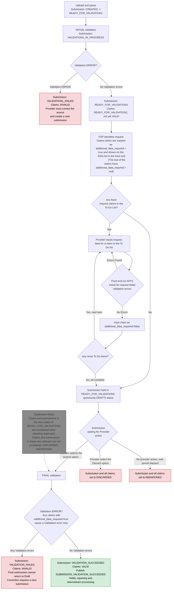

# Inquest submission validation flow

```mermaid
flowchart TD
    A[Upload and parse\n Submission: CREATED -> READY_FOR_VALIDATION1] --> B[INITIAL validation\n Submission: VALIDATION1_IN_PROGRESS]
    B --> C{Validation ERROR?}
    C -->|Validation ERROR| D["Submission: VALIDATION1_FAILED<br/>Claims: INVALID<br/>Provider must correct the source<br/>and create a new submission"]
    C -->|No Validation errors| E["Submission: READY_FOR_VALIDATION2<br/>Claims: READY_FOR_VALIDATION2, not yet VALID"]
    E --> E1["FSP identifies Inquest Claims which are marked as \nadditional_data_required = true and shown on the ToDo list in the front end
                (The rest of the claims have additional_data_required = null)"]
    E1 --> E2{"Are there \nInquest claims in the\n To Do List?"}            
    E2 --> |Yes|F[Provider inputs inquest data for a claim in the To Do list]
    E2 --> |No|G
    F --> F1{"Front end (or API?)\n check for Inquest-fields\n validation errors"}
    F1 --> |Errors Found|F
    F1 --> |No Errors|F2[mark claim as additional_data_required=false]
    F2 --> F3{Any more To Do items?}
    F3 -->|Yes, next item| F
    F3 -->|No, all complete| G["Submission held in READY_FOR_VALIDATION2 (previously DRAFT) status"]
    G --> G1{Submission\n waiting for Provider\n action}
    G1 --> |Provider selects the\n Submit option|H1[FINAL validation]
    G1 --> |Provider select the\n Discard option|H2["Submission and all claims set to DISCARDED"]
    G1 --> |No provider action, wait period elapsed|H3["Submission and all claims set to ABANDONED"]
    H1 --> I{Validation ERROR?\n Any claims with \nadditional_data_required=true cause a \Validation error now.}

    I -->|Any Validation errors| J["Submission: VALIDATION_FAILED<br/>Claims: INVALID<br/>Final submission cannot return to Draft<br/>Correction requires a new submission"]

    I -->|No Validation errors| K["Submission: VALIDATION_SUCCEEDED<br/>Claims: VALID<br/>Publish SUBMISSION_VALIDATION_SUCCEEDED<br/>Notify, reporting and<br/>downstream processing"]

    %% Legend box placed next to H1 (dashed link nudges position)
    L["Duplication Rules<br/>Claims and submissions in the new status of  READY_FOR_VALIDATION2 are considered when checking duplicates.
      Claims and submissions in these new statuses are not considered: DISCARDED, ABANDONED
       "]
    L -.-> H1
    style L fill:#898989,stroke:#333,stroke-width:1px
    classDef fail fill:#f8d7da,stroke:#c00,color:#000;
    classDef ok fill:#d4edda,stroke:#080,color:#000;
    class D,J,H2,H3 fail;
    class K ok;
```
