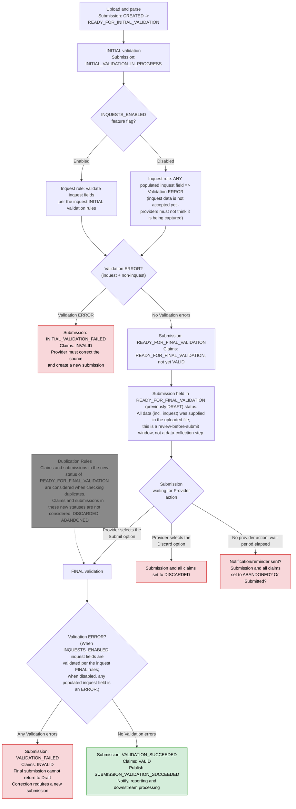

# Inquest submission validation flow

> **Capture model:** all data — inquest *and* non-inquest — arrives in a single bulk file upload and
> undergoes INITIAL validation. Valid submissions are then held in `READY_FOR_FINAL_VALIDATION` as a
> **review-before-submit** window until the provider submits (FINAL validation) or discards. There is
> **no** separate per-claim inquest data-entry step or To-Do list: the data is already present in the
> file. (A previous iteration collected inquest data per claim after upload; that sub-flow has been
> removed.)
>
> **Feature flag `INQUESTS_ENABLED`:** inquest-field handling is gated. While **disabled**, any
> populated inquest field fails INITIAL validation, so providers cannot believe the data is being
> accepted yet. While **enabled**, inquest fields are validated per the inquest validation rules.

