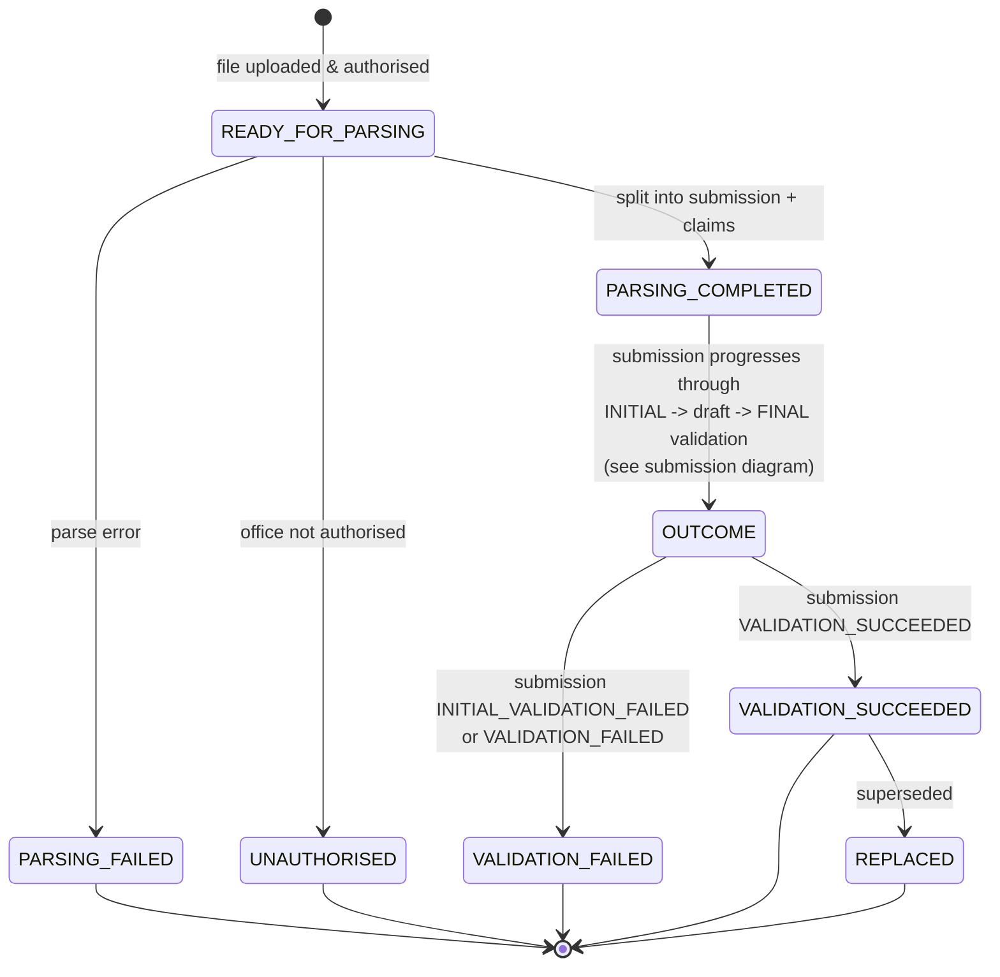

# Bulk submission — state-transition diagram (recommended model)

Companion to [ADR-0001](./adr-0001-draft-submission-and-two-stage-validation.md). Shows the
`BulkSubmissionStatus` lifecycle.

**Change from the earlier draft of this doc:** the updated [`inquest-flow.md`](./inquest-flow.md)
now models the **initial-validation lifecycle and the draft-hold on the `submission`**, not on the
bulk-submission layer. The bulk layer therefore stays focused on **parsing** and the **overall
outcome**; per-stage initial/final validation and draft/discard/abandon states live on the
[submission](./state-transition-submission.md) and [claim](./state-transition-claim.md) diagrams.

Existing bulk values are retained. `VALIDATION_SUCCEEDED` / `VALIDATION_FAILED` at this layer reflect
the **final** outcome once the underlying submission completes.

> `OUTCOME` above is a **modelling helper** (choice pseudo-state), not a persisted enum value. The
> whole initial → draft → final journey happens on the `submission`; the bulk record only reflects
> the terminal outcome.

## Status reference (persisted values)

| Status | New? | Meaning |
|--------|------|---------|
| `READY_FOR_PARSING` | existing | Uploaded, authorised, queued for parsing |
| `PARSING_COMPLETED` | existing | Split into submission + claims; submission takes over the validation lifecycle |
| `PARSING_FAILED` | existing | Could not parse the file |
| `UNAUTHORISED` | existing | Office not authorised |
| `VALIDATION_SUCCEEDED` | existing | Underlying submission passed final validation |
| `VALIDATION_FAILED` | existing | Underlying submission failed initial or final validation |
| `REPLACED` | existing | Superseded by a later bulk submission |

## Notes / open decisions

- **No new bulk statuses are proposed.** The initial-stage (`READY_FOR_INITIAL_VALIDATION`,
  `INITIAL_VALIDATION_IN_PROGRESS`, `INITIAL_VALIDATION_FAILED`), draft-hold
  (`READY_FOR_FINAL_VALIDATION`) and terminal draft states (`DISCARDED`, `ABANDONED`) live on the
  **submission** and **claim**, keeping bulk-layer enum/constraint churn to zero.
- **Open question:** should the bulk record distinguish an initial-stage failure (e.g. a dedicated
  status) or continue to collapse both initial and final failures into `VALIDATION_FAILED`? The
  per-message `stage` field (see ADR) preserves the distinction regardless, so collapsing is the
  cheaper default.
- **Open question:** how should the bulk record reflect a draft that is `DISCARDED` or `ABANDONED`?
  Options: leave it in `PARSING_COMPLETED`, or add bulk-level terminal states. Decide alongside the
  submission model.
- Any new bulk value (if introduced) must be added to the bulk-submission `CHECK` constraint in
  **both** the API and reporting DBs.
