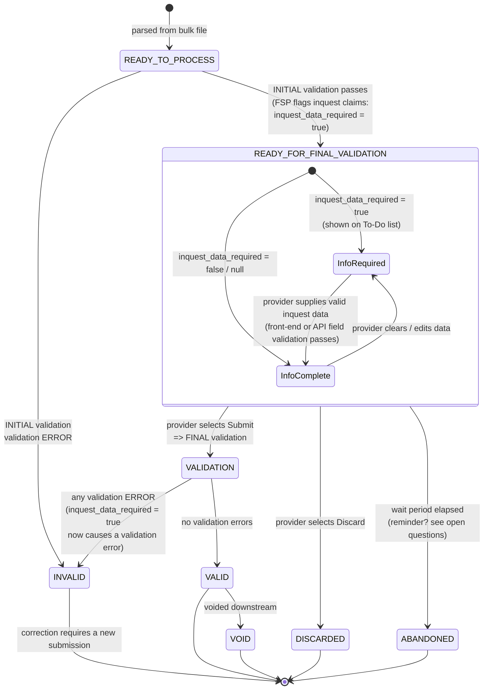

# Claim — state-transition diagram (recommended model)

Companion to [ADR-0001](./adr-0001-draft-submission-and-two-stage-validation.md). Shows the
recommended `ClaimStatus` lifecycle under draft submission and two-stage validation, aligned to
[`inquest-flow.md`](./inquest-flow.md).

- **Result** statuses (`VALID`, `INVALID`, `VOID`) keep their existing meaning.
- `READY_FOR_FINAL_VALIDATION` is the new draft-holding state after initial validation passes
  (previously called "DRAFT"; supersedes the earlier working name `READY_FOR_SUBMISSION`).
- `inquest_data_required` is an **orthogonal flag** (true / false / null), not a status. It is set by
  the **Fee Scheme Platform (FSP)**, which identifies inquest claims during the initial stage; those
  claims appear on the front-end To-Do list. (Generalises to a `requires_additional_information` flag
  if the capability extends beyond inquest — see ADR.)
- `DISCARDED` / `ABANDONED` are new terminal draft states and are **excluded** from duplicate checks
  and reporting.



## Status reference

| Status | Stage | Meaning | Duplicate check? | Reportable? |
|--------|-------|---------|------------------|-------------|
| `READY_TO_PROCESS` | pre-initial | Parsed; awaiting initial validation | Yes | No |
| `READY_FOR_FINAL_VALIDATION` | draft | Passed initial validation; may await inquest data | **Yes** | No |
| `VALID` | final result | Passed final validation | Yes | Yes |
| `INVALID` | either result | Validation ERROR at initial or final validation | No | No |
| `VOID` | post-submit | Voided downstream | n/a | Yes (as void) |
| `DISCARDED` | terminal draft | Provider discarded draft | **No** | No |
| `ABANDONED` | terminal draft | Draft expired (subject to open question) | **No** | No |

## Notes

- `inquest_data_required` is a separate boolean column; combining it with
  `READY_FOR_FINAL_VALIDATION` avoids a combinatorial explosion of statuses.
- Per the flowchart, FSP **identifies** inquest claims at the initial stage (rather than the missing
  data being recorded as a WARNING). If `inquest_data_required` is still `true` when the provider
  submits, it becomes a **validation ERROR** at the FINAL stage — captured via the `stage` field on
  `validation_message_log`.
- The UI renders "Draft / Discarded / Abandoned / Submitted" via the derived business status; raw
  `ClaimStatus` stays stable for machine consumers (see `derived-claim-status.md`).
- `DuplicateClaimValidation` must be updated from `List.of(READY_TO_PROCESS, VALID)` to also include
  `READY_FOR_FINAL_VALIDATION`, and to exclude `DISCARDED`/`ABANDONED`.
```
