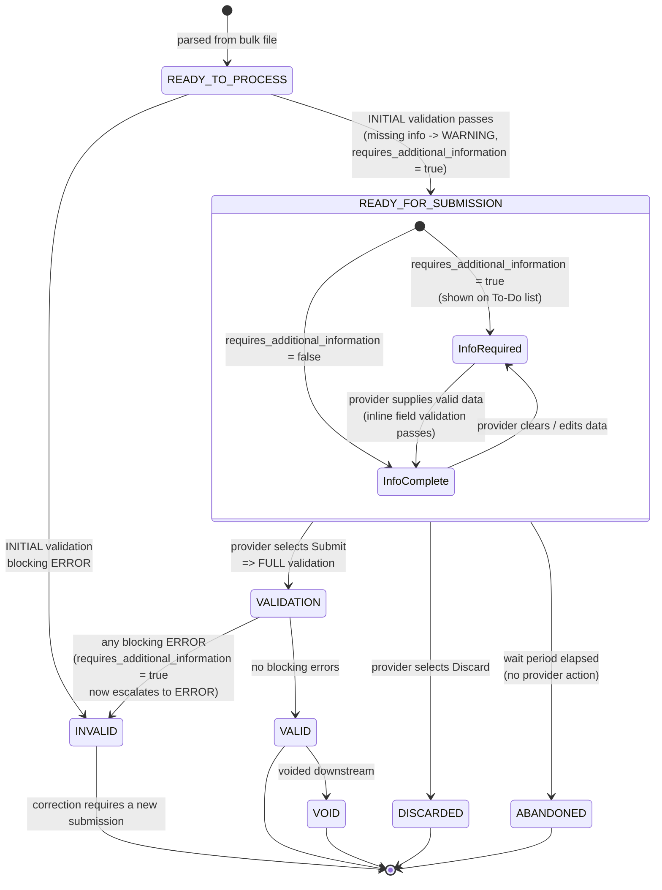

# Claim — state-transition diagram (recommended model)

Companion to [ADR-0001](./adr-0001-draft-submission-and-two-stage-validation.md). Shows the
recommended `ClaimStatus` lifecycle under draft submission and two-stage validation.

- **Result** statuses (`VALID`, `INVALID`, `VOID`) keep their existing meaning.
- `READY_FOR_SUBMISSION` is the new draft-holding state after initial validation passes.
- `requires_additional_information` (generalising `inquest_data_missing`) is an **orthogonal flag**,
  not a status — shown here as guards/notes.
- `DISCARDED` / `ABANDONED` are new terminal draft states and are **excluded** from duplicate checks
  and reporting.



## Status reference

| Status | Stage | Meaning | Duplicate check? | Reportable? |
|--------|-------|---------|------------------|-------------|
| `READY_TO_PROCESS` | pre-initial | Parsed; awaiting initial validation | Yes | No |
| `READY_FOR_SUBMISSION` | draft | Passed initial validation; may await additional info | **Yes** | No |
| `VALID` | full result | Passed full validation | Yes | Yes |
| `INVALID` | either result | Blocking ERROR at initial or full validation | No | No |
| `VOID` | post-submit | Voided downstream | n/a | Yes (as void) |
| `DISCARDED` | terminal draft | Provider discarded draft | **No** | No |
| `ABANDONED` | terminal draft | Draft expired | **No** | No |

## Notes

- `requires_additional_information` is a separate boolean column; combining it with
  `READY_FOR_SUBMISSION` avoids a combinatorial explosion of statuses.
- The same rule can be a **WARNING at INITIAL** and a **blocking ERROR at FULL** — captured via the
  `stage` field on `validation_message_log`.
- The UI renders "Draft / Discarded / Abandoned / Submitted" via the derived business status; raw
  `ClaimStatus` stays stable for machine consumers (see `derived-claim-status.md`).
- `DuplicateClaimValidation` must be updated from `List.of(READY_TO_PROCESS, VALID)` to also include
  `READY_FOR_SUBMISSION`, and to exclude `DISCARDED`/`ABANDONED`.
```
