# Submission — state-transition diagram (recommended model)

Companion to [ADR-0001](./adr-0001-draft-submission-and-two-stage-validation.md). Shows the
recommended `SubmissionStatus` lifecycle, aligned to [`inquest-flow.md`](./inquest-flow.md). The
model uses **explicit per-stage statuses** (ADR Option 1): the initial-validation lifecycle is
represented directly on the submission rather than only at the bulk-submission layer.

- New **initial-stage** statuses: `READY_FOR_INITIAL_VALIDATION`, `INITIAL_VALIDATION_IN_PROGRESS`,
  `INITIAL_VALIDATION_FAILED`.
- `READY_FOR_FINAL_VALIDATION` is the **draft-hold** state (previously called "DRAFT"; supersedes the
  earlier working name `READY_FOR_SUBMISSION`).
- `VALIDATION_IN_PROGRESS`, `VALIDATION_SUCCEEDED`, `VALIDATION_FAILED` are reused for the **FINAL**
  validation stage.
- `DISCARDED`, `ABANDONED` are new terminal draft states.

```mermaid
stateDiagram-v2
    [*] --> CREATED : created by parser<br/>(event service)
    CREATED --> READY_FOR_INITIAL_VALIDATION : upload and parse complete

    READY_FOR_INITIAL_VALIDATION --> INITIAL_VALIDATION_IN_PROGRESS : INITIAL validation starts

    INITIAL_VALIDATION_IN_PROGRESS --> INITIAL_VALIDATION_FAILED : validation ERROR<br/>(all claims -> INVALID)
    INITIAL_VALIDATION_IN_PROGRESS --> READY_FOR_FINAL_VALIDATION : no validation errors<br/>(draft; FSP flags inquest claims)

    READY_FOR_FINAL_VALIDATION --> VALIDATION_IN_PROGRESS : provider selects Submit<br/>=> FINAL validation
    READY_FOR_FINAL_VALIDATION --> DISCARDED : provider selects Discard
    READY_FOR_FINAL_VALIDATION --> ABANDONED : wait period elapsed<br/>(reminder sent? see open questions)

    VALIDATION_IN_PROGRESS --> VALIDATION_SUCCEEDED : no validation errors<br/>(publish SUBMISSION_VALIDATION_SUCCEEDED)
    VALIDATION_IN_PROGRESS --> VALIDATION_FAILED : any validation ERROR<br/>(all claims -> INVALID)

    VALIDATION_SUCCEEDED --> REPLACED : superseded by a later submission
    INITIAL_VALIDATION_FAILED --> [*] : correction requires a new submission
    VALIDATION_FAILED --> [*] : correction requires a new submission
    VALIDATION_SUCCEEDED --> [*]
    REPLACED --> [*]
    DISCARDED --> [*]
    ABANDONED --> [*]

    note right of CREATED
      NIL submissions created via the API
      short-circuit directly to
      VALIDATION_SUCCEEDED (unchanged).
    end note
```



## Status reference

| Status | New? | Meaning | Reportable? |
|--------|------|---------|-------------|
| `CREATED` | existing | Created by parser | No |
| `READY_FOR_INITIAL_VALIDATION` | **new** | Parsed; queued for initial (file) validation | No |
| `INITIAL_VALIDATION_IN_PROGRESS` | **new** | Initial validation running | No |
| `INITIAL_VALIDATION_FAILED` | **new** | Initial validation error; provider must re-upload | No |
| `READY_FOR_FINAL_VALIDATION` | **new** | Passed initial validation; draft awaiting provider action (previously "DRAFT") | No |
| `VALIDATION_IN_PROGRESS` | existing (scoped to FINAL) | Final validation running | No |
| `VALIDATION_SUCCEEDED` | existing | Final validation passed; downstream/reporting | **Yes** |
| `VALIDATION_FAILED` | existing | Final validation error | No |
| `REPLACED` | existing | Superseded by a later submission | No |
| `DISCARDED` | **new** | Provider discarded the draft | No |
| `ABANDONED` | **new** | Draft expired without action (subject to open question) | No |

## Notes

- The existing `READY_FOR_VALIDATION` is effectively split into `READY_FOR_INITIAL_VALIDATION` and
  `READY_FOR_FINAL_VALIDATION`. Decide whether to retire `READY_FOR_VALIDATION` or map it to
  `READY_FOR_FINAL_VALIDATION` (see ADR migration notes).
- Reporting materialized views whitelist `submission_status = 'VALIDATION_SUCCEEDED'`, so the new
  initial/draft states are excluded by default — **verify per report** and add the new values to the
  reporting DB `CHECK` constraints so ingestion does not fail.
- Events: final validation still publishes `SUBMISSION_VALIDATION_SUCCEEDED`. New/renamed events are
  likely needed for the initial stage and for submit/discard/abandon — see ADR follow-ups.
- `ABANDONED` requires a timeout/scheduler that does not exist today (all transitions are SQS-driven).
  The flowchart also raises whether the wait-period expiry should instead trigger a reminder or an
  automatic submission — see [ADR](./adr-0001-draft-submission-and-two-stage-validation.md) open
  questions.
```
